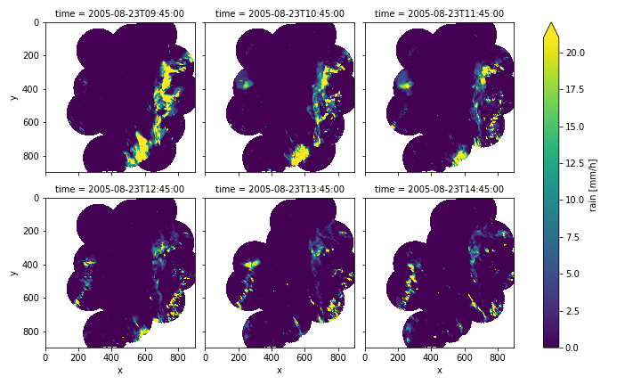

# RADOLAN Scraper
A pipeline to scrape and transform [RADOLAN](https://www.dwd.de/DE/leistungen/radolan/radolan.html) data into netcdf. RADOLAN is a product from the [*Deutscher Wetter Dienst*](https://www.dwd.de/DE/Home/home_node.html) that provides high resolution precipitation records from 2005 - present
for Germany.

While the data is openly available, it is not in a format that can be easily processed.
The included pipeline downloads and transforms data into a single netcdf file, that can
be processed by standard tools like [`xarray`](http://xarray.pydata.org/en/stable/).

## Installation
Create an environment, using the environment manager of your choice and run

    pip install -r requirements.txt


## Usage
Add a `.env` file in the top level directory specifying a path to store the data.
Additionally, you can specify a logging configuration, but that is not required as a sensible default 
is included. 

    BASE_DATA_DIR=/my/data/dir/
    LOG_CFG=logging.yaml  # Not required. 

By default the pipeline will download all data for the year 2005 - 2018. While
the pipelines has constant memory requirements, it will create files consuming ~50G disk space.
To only download data for a subset of years, edit the `__main__` section in `pipeline.py` directly.
Then run

    python radonlan_scraper/pipeline.py


## Further processing
Once the pipeline ran through, you can visualize the data, for example using `xarray`
```python
import xarray as xr
ds = xr.open_dataset("path/to/combined.nc")
ds["rain"][2000:2006].plot.imshow("x", "y", col="time", col_wrap=3, robust=True, origin="upper")
```
